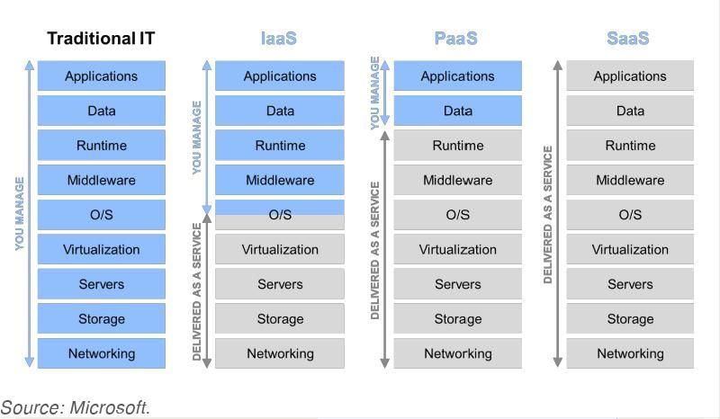

## About the Project

- Introduction to Cloud Computing

&nbsp;

---

&nbsp;

## Introduction

- Service Models
- Essential Characteristics
- Deployment Models

---

- NIST Definition of Cloud Computing
- Infrastructure as a service (IaaS)
  - AWS (Undifferentiated heavy lifting)
  - Azure
- Platform as a service (PaaS)
  - AWS Oracle database
  - [Software Factory](https://www.sf.com/?lang=en)
- Software as a service (SaaS)
  - Gmail
  - [Software Factory](https://www.sf.com/?lang=en)

&nbsp;

---

&nbsp;

## 5 Essential Characteristics

1. On-demand self-service (Automation Process)
2. Broad network access (Over the network)
3. Resource pooling (Multi-tenant model & location independence)
4. Rapid elasticity (Scale rapidly outward and inward commensurate with demand)
5. Measured service (Resource usage can be monitored, controlled, and reported)

&nbsp;

---

&nbsp;

## Deployment Models

- Private cloud
- Community cloud
- Public cloud
  - AWS
  - Azure
  - Salesforce
- Hybrid cloud

&nbsp;

---

&nbsp;
